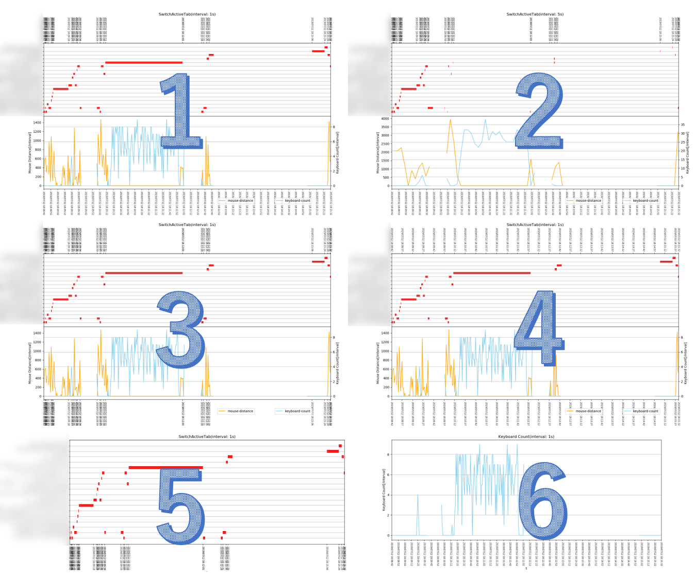

# GanttLogger
アクティブタブ，マウス移動距離，そしてキーボード打鍵数を観測し，ログ書き出しや多様なグラフの生成をするCLI．  
(PyPI)[https://pypi.org/project/ganttlogger/](https://pypi.org/project/ganttlogger/)
- [README - in English](https://github.com/KagenoMoheji/GanttLogger/blob/master/README.md)

***
## <span id="0">目次</span>
- [使用環境(テスト済み)](#1)
- [はじめよう](#2)
    - [導入](#2-1)
        - [Windows](#2-1-1)
        - [MacOS](#2-1-2)
    - [クイックスタート](#2-2)
    - [フォルダ"ganttlogger_logs"の構成](#2-3)
- [コマンドオプション](#3)
    - [alone](#a)
    - [observer](#o)
    - [logger](#l)
    - [plotter](#p)
    - [displayer](#d)
- [課題](#4)
- [これから](#5)
- [License](#6)

***

## <span id="1">使用環境(テスト済み)</span> [▲](#0)
- OS
    - Windows10(64bit)
    - MacOS Mojave
- Python
    - 3.7

## <span id="2">はじめよう</span> [▲](#0)
### <span id="2-1">導入</span> [▲](#0)
- <span id="2-1-1">**Windows**</span>  
2つの導入方法があります．
    - `pip`でインストールする場合
        1. python3をインストールしてください．
        2. 下記のようにして`pip`でインストールします．
            ```
            > python -m pip install ganttlogger
            ```
    - `ganttlogger-exe-x86_64-<version>.zip`(実行ファイル)をダウンロードすることで導入する場合
        - 専用のREADMEがあるのでそちらを読んでください．
            - [In English](https://github.com/KagenoMoheji/GanttLogger/blob/master/exe/README.md#w)
            - [日本語版](https://github.com/KagenoMoheji/GanttLogger/blob/master/exe/README-ja.md#w)
- <span id="2-1-2">**MacOS**</span>
2つの導入方法があります．
    - `pip`でインストールする場合
        1. python3とpip3をインストールしてください．
        2. 下記のようにして`pip3`でインストールします．
            ```
            $ pip3 install ganttlogger
            ```
        3. `pip3`でインストールできない場合は，[Releases](https://github.com/KagenoMoheji/GanttLogger/releases)または[PyPI](https://pypi.org/project/ganttlogger/)から`ganttlogger-<version>.tar.gz`をダウンロードして解凍し，下記のコマンドを実行してインストールしてください．
            ```
            $ python3 setup.py install
            ```
        4. キーボード入力の取得を許可するために，システム環境設定の「セキュリティとプライバシー」の「アクセシビリティ」に，「Terminal.app」を追加してください．
    - `ganttlogger-exe-macos-<version>.zip`(実行ファイル)をダウンロードすることで導入する場合
        - 専用のREADMEがあるのでそちらを読んでください．
            - [In English](https://github.com/KagenoMoheji/GanttLogger/blob/master/exe/README.md#m)
            - [日本語版](https://github.com/KagenoMoheji/GanttLogger/blob/master/exe/README-ja.md#m)

### <span id="2-2">クイックスタート</span> [▲](#0)
1. "Alone"モード(PC単体でモニタリングとログ出力の両方をする)を実行してみます．
    ```
    $ ganttlogger
    ```
2. (モード"Alone"または"Observer"で実行されている)CLIを中断させるには，`1`+`0`+`z`+`m`のキーを**連打(同時長押しではありません)** します．
3. カレントディレクトリに生成されたフォルダ`ganttlogger_logs`を確認してください．  
そのフォルダ構成を知りたい場合は，[フォルダ"ganttlogger_logs"の構成](#2-3)を参照ください．
- もし下記の問題に遭遇したら…
    - Windowsで`ModuleNotFoundError: No module named 'win32gui'`
        - 下記を実行して`pywin32`の再インストールを試してください．
            ```
            > python -m pip uninstall pywin32 & python -m pip install pywin32
            ```
    - グラフプロット時に下記のエラー文が出た．
        ```
        /usr/local/lib/python3.7/site-packages/matplotlib/backends/backend_agg.py:211: RuntimeWarning: Glyph 128266 missing from current font.
        font.set_text(s, 0.0, flags=flags)
        /usr/local/lib/python3.7/site-packages/matplotlib/backends/backend_agg.py:180: RuntimeWarning: Glyph 128266 missing from current font.
        font.set_text(s, 0, flags=flags)
        ```
        - 問題ありません．無視してください．

### <span id="2-3">フォルダ"ganttlogger_logs"の構成</span> [▲](#0)
```
ganttlogger_logs
├ (ID)
    ├ active_tab.log
    ├ mouse.log
    ├ keyboard.log
    └ graphs
        ├ output_(date)_all.pkl
        ├ output_(date)_all.png
        ...
├ (ID)
    ├ active_tab.log
    ...
...
```
- `(ID)`: ganttloggerによって発行される一意のIDです．フォルダ名にもなります．
- `~.log`: ログデータのファイルです．
- `~.pkl`: 動的グラフのバイナリファイルです．
- `~.png`: 静的グラフの画像ファイルです．

## <span id="3">コマンドオプション</span> [▲](#0)
```
usage: ganttlogger [--observer] [--logger] [--uuid <UUID>] [--help] [--plotter] [--withplot] [--displayer]

This CLI will do Observing active-tab, mouse, keyboard,
and Logging them,
and Plotting graphs (active-tab=ganttchart, mouse=line, keyboard=bar).
If you don't set any option, this work both of 'observer' and 'logger'.

optional arguments:
  -h, --help            show this help message and exit
  -o, --observer        The role of this PC is only observing action.
  -l, --logger          The role of this PC is only logging and plotting. You must also set '--uuid'.
  -u UUID, --uuid UUID  When you set '--logger', you must also set this by being informed from 'observer' PC.
  -p, --plotter         Use this option if you want other outputs by a log in the current directory after getting one and a graph.
  --withplot            Use this option when you want to get a graph after running 'Alone'.
  -d, --displayer       Use this option when you want to look a graph from a '.pkl' file.
```
- <span id="o"></span><span id="l"></span>**`--observer`と`--logger`は実装していないのでまだ機能しません．**
- <span id="a"></span>`observer`と`logger`をPC単体で行う`alone`を実行したい場合は，オプション無しの`ganttlogger`のみを実行してください．
    - なお，ログとともにグラフも出力させたい場合はオプション`--withplot`を追加してください．  
    それによって出力されるグラフの例は，[Graph Examples](#graphs)の1番です．
- <span id="p"></span>ほかのグラフを得たい場合は，ログファイルのあるディレクトリに移動して，オプション`--plotter`を追加して実行してください．
    - グラフを得るために，いくつか設定する必要があります．
    - まず，  
        ```
        Select plot types separated by ',',  or enter without input.:
        ```
        グラフ操作のキーワードを(複数選択可能)選択してください．
    - `set_interval`を選択した場合は，1点の設定をします．
        ```
        Set the number of interval by seconds:
        ```
        "5"と入力した場合のグラフの例が[Graph Examples](#graphs)の2番です．
    - `filter_tab`を選択した場合は，2点の設定をします．
        ```
        (1)Input a file name written a list of tab text you want to filter.:

        (2)Do you want to hide mouse and keyboard graph depictions of the duration filtered regarding tab text?(Y/n) :
        ```
    - `select_data`を選択した場合は，1点の設定をします．
        ```
        Select 'all' or list separated by ',' from ('active_tab'|'mouse'|'keyboard'|'mouse-keyboard').:
        ```
        "active_tab" と "keyboard"とそれぞれ入力した場合のグラフの例が[Graph Examples](#graphs)の5番と6番です．
    - `xaxis_type`を選択した場合は，2点の設定をします．
        ```
        (1)Select x-axis type for ActiveTab from whether 'active-start' or number of the interval by seconds:

        (2)Select x-axis type for Mouse or Keyboard from whether 'active-start' or number of the interval by seconds:
        ```
        "(1)active-start(2)active-start" と "(1)15(2)15"とそれぞれ入力した場合のグラフの例が[Graph Examples](#graphs)の3番と4番です．
- <span id="d"></span>`~.pkl`ファイルを用いて動的グラフを見たい場合は，オプション`--displayer`を追加して実行してください．
    - 1点の設定入力を行う必要があります．
        ```
        Input file name of '.pkl':
        ```

### <span id="graphs">Graph Examples</span>
- All graphs were plotted **from same logs**.


## <span id="4">課題</span> [▲](#0)
- Macで長時間このCLIを実行すると，メモリを食いすぎてメモリ不足に陥ってしまう．  
原因はMac特有の依存モジュールである`pyobjc`にあると考えているが，どうやってメモリ解放できるかわからない．  
[Memory leak pyobjc - stack overflow](https://stackoverflow.com/questions/40720149/memory-leak-pyobjc)
- Macで`pyinstaller`や`auto-py-to-exe`を使って実行ファイルを作成しようとするが，`--add-data`による`/config/font/ipaexg.ttf`の追加ができず，FileNotFoundErrorになる．
- [Graph Examples](promo/graphs.PNG)の2番のように，`set_interval`で2秒以上を設定した場合に一部のガントチャートが消滅する原因究明・修正．
- `Observer.py`においてWindows向けで起きる下記のスレッドエラーの原因究明・修正．
    ```
    Exception in thread Thread-1:
    Traceback (most recent call last):
    ...
    ```
- 期間が短いログに対しPlotterを実行するとたまに以下のエラーが発生する．
    ```
    Traceback (most recent call last):
        File "/usr/local/bin/ganttlogger", line 10, in <module>
            sys.exit(main())
        File "/usr/local/lib/python3.7/site-packages/ganttlogger/app.py", line 42, in main
            plotter.start()
        File "/usr/local/lib/python3.7/site-packages/ganttlogger/modules/Plotter.py", line 248, in start
            self.run()
        File "/usr/local/lib/python3.7/site-packages/ganttlogger/modules/Plotter.py", line 272, in run
            self.get_mouse()
        File "/usr/local/lib/python3.7/site-packages/ganttlogger/modules/Plotter.py", line 691, in get_mouse
            current_time = self.plot_active_tab[0][0].replace(microsecond=0)
    IndexError: index 0 is out of bounds for axis 0 with size 0
    ```
- 標準入力のバッファクリアの実装を試みるが，難題です．助言やプルリクを求めます．

## <span id="5">これから</span> [▲](#0)
- 関数への共通化による`Plotter.py`のコード最適化
- 2台以上運用・リモート形式の`--observer`と`--logger`の実装．

## <span id="6">LICENSE</span> [▲](#0)
MIT LICENSE.